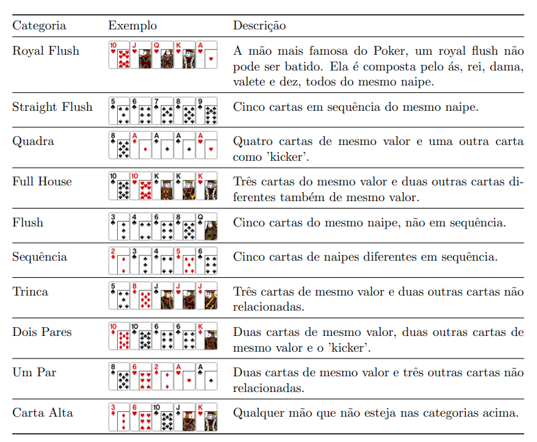

# Desafio PokerHands

### Tarefa

Um famoso cassino de repente enfrenta um grande declínio de sua receita. Eles decidem oferecer uma versão online de Poker. Pode ajudá-los escrevendo um
algoritmo para rankear mãos de poker?

1. Crie uma classe que represente uma m˜ao de poker (PokerHand) e nela crie um método para compará-la com outra mão de poker.

```java
Result result = pokerHand.compareWith(anotherPokerHand)
```

2. O resultado deve ser um enum com os resultados: `WIN`, `LOSS` e `DRAW`.

3. A classe `PokerHand` deverá ter um construtor que aceite uma String contendo 5 cartas:

```java
PokerHand pokerHand = new PokerHand("KS 2H 5C JD TD")
```

4. As características da String de cartas são:

- Um espaço é usado como separador de cada carta
- Cada carta consiste em dois caracteres
- O primeiro caracter é o valor da carta. Caracteres válidos são:

| Char |  Valor |
|:----:|:------:|
|   2  |    2   |
|   3  |    3   |
|   4  |    4   |
|   5  |    5   |
|   6  |    6   |
|   7  |    7   |
|   8  |    8   |
|   9  |    9   |
|   T  |   10   |
|   J  | Valete |
|   Q  | Rainha |
|   K  |   Rei  |
|   A  |   Ace  |

- O segundo caracter é o naipe da carta. Caracteres válidos são:

| Char |  Naipe  |
|:----:|:-------:|
|   S  | Espadas |
|   H  |  Copas  |
|   D  |  Ouros  |
|   C  |   Paus  |


5. A força de uma carta individual é dado pelo seu valor, na ordem em que foram listadas acima, tendo o `Ace` como a carta mais forte.

6. Para verificar qual mão é mais forte, essa deve ser classificada de acordo com as regras listadas na tabela abaixo, a qual lista elas por ordem de força.

7. Caso ambas mãos sejam de mesma categoria, o desempate é realizado de forma que grupos maiores (caso existam) e de maior valor sejam comparados entre si e, caso o empate persista, os próximos grupos menores ou cartas separadas mais fortes são comparadas até que o empate seja desfeito ou seja declarado empate. Observação: o naipe não tem valor no desempate.



### Testes

O funcionamento da solução deve ser garantida através de testes unitários. A seguir encontra-se uma tabela com as comparações e seus resultados.
Essas são as comparaçõeses mínimas que devem ser feitas para garantir o funcionamento. Utilize essa tabela para implementar os testes unitários.

|PokerHand1       | PokerHand2       | Resultado   |
|:---------------:|:----------------:|:-----------:|
|"9C TC JC QC KC" | "9C 9H 5C 5H AC" | Result.WIN  |
|"TC TH 5C 5H KH" | "9C 9H 5C 5H AC" | Result.WIN  |
|"TS TD KC JC 7C" | "JS JC AS KC TD" | Result.LOSS |
|"7H 7C QC JS TS" | "7D 7C JS TS 6D" | Result.WIN  |
|"5S 5D 8C 7S 6H" | "7D 7S 5S 5D JS" | Result.LOSS |
|"AS AD KD 7C 3D" | "AD AH KD 7C 4S" | Result.LOSS |
|"TS JS QS KS AS" | "AC AH AS AS KS" | Result.WIN  |
|"TS JS QS KS AS" | "TC JS QC KS AC" | Result.WIN  |
|"TS JS QS KS AS" | "QH QS QC AS 8H" | Result.WIN  |
|"AC AH AS AS KS" | "TC JS QC KS AC" | Result.WIN  |
|"AC AH AS AS KS" | "QH QS QC AS 8H" | Result.WIN  |
|"TC JS QC KS AC" | "QH QS QC AS 8H" | Result.WIN  |
|"7H 8H 9H TH JH" | "JH JC JS JD TH" | Result.WIN  |
|"7H 8H 9H TH JH" | "4H 5H 9H TH JH" | Result.WIN  |
|"7H 8H 9H TH JH" | "7C 8S 9H TH JH" | Result.WIN  |
|"7H 8H 9H TH JH" | "TS TH TD JH JD" | Result.WIN  |
|"7H 8H 9H TH JH" | "JH JD TH TC 4C" | Result.WIN  |
|"JH JC JS JD TH" | "4H 5H 9H TH JH" | Result.WIN  |
|"JH JC JS JD TH" | "7C 8S 9H TH JH" | Result.WIN  |
|"JH JC JS JD TH" | "TS TH TD JH JD" | Result.WIN  |
|"JH JC JS JD TH" | "JH JD TH TC 4C" | Result.WIN  |
|"4H 5H 9H TH JH" | "7C 8S 9H TH JH" | Result.WIN  |
|"4H 5H 9H TH JH" | "TS TH TD JH JD" | Result.LOSS |
|"4H 5H 9H TH JH" | "JH JD TH TC 4C" | Result.WIN  |
|"7C 8S 9H TH JH" | "TS TH TD JH JD" | Result.LOSS |
|"7C 8S 9H TH JH" | "JH JD TH TC 4C" | Result.WIN  |
|"TS TH TD JH JD" | "JH JD TH TC 4C" | Result.WIN  |
|"2S 3H 4D 5H 6D" | "5H 6D 7H 8C 9C" | Result.LOSS |
|"2S 3H 4H 5H 6D" | "2S 3H 4D 5H 6C" | Result.DRAW |
|"2H 3H 4H 5H 7H" | "2D 3D 4D 5D 8D" | Result.LOSS |
|"2S 2H 2D 5H 6D" | "5H 5D 5H 8C 9C" | Result.LOSS |
|"2H 3H 4H 5H 6H" | "5H 6H 7H 8H 9H" | Result.LOSS |
|"TH JH QH KH AH" | "TC JC QC KC AC" | Result.DRAW |
|"TH TH TH TH AS" | "9C 9C 9C 9C 2S" | Result.WIN  |
|"TH TH TH AH AS" | "9C 9C 9C 2C 2S" | Result.WIN  |
|"2H 4H 6H 8H AS" | "3C 5C 6C 8C JS" | Result.WIN  |
|"2H 2H 2H AH AS" | "2C 2C 2C JC JS" | Result.WIN  |
|"2H 2H 5H AH AS" | "2C 2C 6C AC AS" | Result.LOSS |
|"2H 3C 3D 3S 6H" | "2C 3D 4D 5C 6C" | Result.LOSS |
|"AS 2S 5S 8S QS" | "KS JS 5S 8S QS" | Result.WIN  |